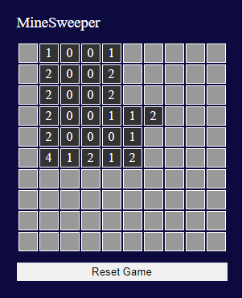
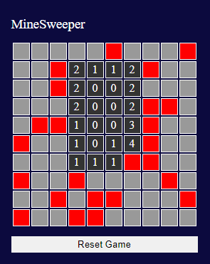
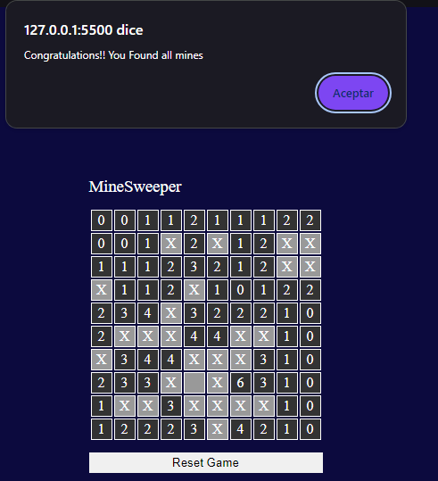

<h1 align="center"> 🎮 Minesweeper Game </h1>


This is a simple web-based implementation of the classic Minesweeper game. The game generates a 10x10 grid with randomly placed mines. The objective is to uncover all the cells that are not mines without triggering any of the hidden mines.

## ✨ Features
- 🟦 **10x10 grid**
- 💣 **30 randomly placed mines**
- 🔍 **Automatically reveals adjacent cells when no mines are nearby**
- 🔢 **Displays the number of surrounding mines**
- 🔄 **Reset button to start a new game**
- 🛠️ **Test mode** to show mines for easier debugging

## 🎯 How to Play
- 🖱️ Click on any cell to reveal it.
- 🧮 Numbers indicate how many mines are adjacent to that cell.
- 🚫 Avoid clicking on mines! If you do, the game will reveal all the mines and end.
- 🏆 To win, uncover all cells that are not mines.

## 🛠️ Installation
1. Clone the repository:
   ```bash
   git clone https://github.com/Kdaniel06/minesweeper.git
   ```

2. Navigate to the project folder:
    ```bash
    cd minesweeper
    ```
    
3. Open the index.html file in your web browser.

## 🖼️ Screenshots
Some game screenshots:

<div style="display: flex; justify-content: space-around;">
    
    
    
</div>

## 🛠️ Customization
You can toggle test mode by setting the testMode variable to true or false in the JavaScript file (index.js), which will show the locations of all mines.

## 🙏 Acknowledgments
This project is inspired by a tutorial from the YouTube channel **AsmrProg**. You can check out the original video [here](https://youtu.be/Fv8wsgkQXrM?si=qGEjFYVw62Q2XsJQ).